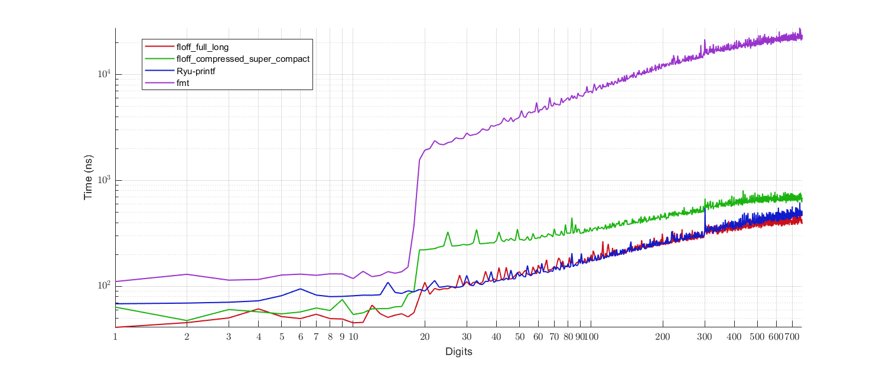

# floff
A test repository for the WIP algorithm for fixed-precision floating-point formatting.



- **Red**: Proposed algorithm with the full (9904 bytes) cache table and the long (3720 bytes) extended cache table.
- **Green**: Proposed algorithm with the compressed (584 bytes) cache table and the super-compact (597 bytes) extended cache table.
- **Blue**: Ryu-printf (reference implementation).
- **Purple**: fmtlib.

Compiled binary size of the benchmark program:
```
                                base :   59,904 bytes
                floff full-long only :   88,576 bytes (base + 28,672 bytes)
 floff compressed-super-compact only :   79,872 bytes (base + 19,968 bytes)
                     Ryu-printf only :  171,520 bytes (base + 111,616 bytes)
                above three together :  220,160 bytes (base + 160,256 bytes)
```
